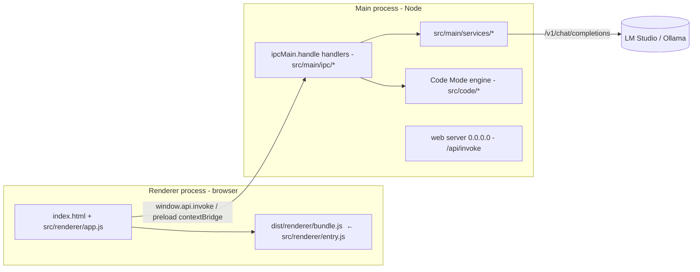

# Architecture

How Agent Smith is laid out after the `src/` restructure, the two run paths, the
IPC surface, and the design for the work that remains.

## Process model



The renderer is bundled by **esbuild** (`scripts/build-renderer.js`) from
`src/renderer/entry.js` into `dist/renderer/bundle.js` (IIFE modules attaching
`window.XK*` globals). `src/renderer/app.js` loads as a second `<script>` and is the
DOM shell (auth, chat/agent streaming, mode toggles). The main process is **not**
bundled; it uses Node `require` against `src/main/*` and `src/code/*`.

## The three modes

Mutually-exclusive toggles; all share one message box with per-mode persisted state.

| | Chat | Agent | Code |
|---|---|---|---|
| Toggle | both off | AGENT on | CODE MODE on |
| Runs in | renderer (`app.js` `sendMessage`) | renderer (`app.js` `sendMessage` + agent tools) | **main process** (`src/code/`) |
| Tools | none (memory optional) | shell + read-only FS (`src/renderer/modes/agentTools.js`) | full write/build loop, phase-gated (`src/code/tools/schemas.js`) |
| Trust | — | command blocklist (`src/shared/commandPolicy.js`), no sandbox | `changeLedger` snapshots + **Revert All** |

Per-mode conversation arrays + rendered snapshots are kept in `app.js`
(`histories`/`modeSnapshots`, with the pure stash/restore in
`src/renderer/modes/modeHistory.js`) and persisted via `save-history`, so messages,
tool cards, and reasoning survive switching modes and relaunch.

## Code Mode engine (`src/code/`)

The build loop runs in the main process, driven from `src/main/ipc/code.js`:

```
loop/runCodeTask.js   -> orchestrator (phases, milestones, resume)
loop/turnLoop.js      -> multi-tool turns: stream, extract tool calls, execute, dedup, early-stop
loop/phases.js        -> explore → implement → verify phase gates
tools/schemas.js      -> tool JSON schemas (read_file, patch, write_file, append_file, run_command, …)
tools/executor.js     -> tool dispatch + ledger snapshots (patch-first edits)
governor/completionGate.js -> "done means verified": syntax, refs, selectors, data, smoke test
context/gemmaHarness.js    -> small-model (Gemma/Qwen) prompt adaptation
```

Trust model is **not** plan approval: Code Mode auto-runs, every write is snapshotted
by `changeLedger`, and the user reviews a unified diff with **Revert All** at the end.
Long runs persist `.agentsmith/PLAN.md` + `IMPLEMENT.md` and can resume from disk.

## IPC

Channel names live once in `src/shared/ipcChannels.js`. The preload bridge
imports them for its whitelist. Code Mode tool definitions live in
`src/code/tools/schemas.js` (dispatched by name in `src/code/tools/executor.js`),
and `tests/codeToolRegistry.test.js` enforces that every Code Mode IPC channel
is whitelisted.

IPC domains now live in `src/main/ipc/*`. `main.js` stays at the repo root as
the bootstrap: it constructs the services, builds one `deps` object, and calls
`registerAllIpc(ipcMain, deps)` (`src/main/ipc/index.js`), which fans out to the
per-domain `register*Ipc(ipcMain, deps)` modules below. Each module closes over
**nothing** global — every service, helper, and the shared mutable `state`
(`{ currentPlanId }`) arrive through `deps`.

| Domain | Channels | File | Status |
|---|---|---|---|
| Auth | `auth-*` | `src/main/ipc/auth.js` | extracted |
| Agent fs/shell | `agent-*` | `src/main/ipc/agent.js` | extracted (owns `activeProcesses`, `nextJobId`, `spawnShell`) |
| Edit | `edit-*` | `src/main/ipc/edit.js` | extracted |
| Project | `project-*` | `src/main/ipc/project.js` | extracted |
| Ledger | `ledger-*` | `src/main/ipc/ledger.js` | extracted |
| Git | `git-*` | `src/main/ipc/git.js` | extracted |
| Memory | `mem-*` | `src/main/ipc/memory.js` | extracted |
| Plugins | `plugin*-*` | `src/main/ipc/plugins.js` | extracted |
| History / dialogs | history, session import/export, file/dir pickers | `src/main/ipc/history.js` | extracted |
| OS / lifecycle | `whatsapp-*`, `tts-*`, `get-gpu-telemetry`, `app-reset`, `set-lms-url`, `get-host-url`, `open-external-url`, `get-env-info` | `main.js` (inline) | stays in bootstrap |
| Web server + static + Cloudflare | n/a | `main.js` (inline) | stays in bootstrap |

The extraction is regression-guarded by `scripts/verify-main-ipc.js`, which
loads the real `main.js` under stubbed electron/whatsapp/http/memory and asserts
every channel registers exactly once and appears in the shared whitelist.

## Restructure status

| Phase | Status |
|---|---|
| 0 — git + .gitignore | done |
| 1 — move modules into `src/` + root shims | done |
| 2 — esbuild renderer bundle | done |
| 3 — split `agentLoop.js` into `loop/*` | done |
| 4 — tool registry + `shared/ipcChannels.js` + integrity test | done (infra + pattern; per-tool module migration is incremental) |
| 5 — split `main.js` IPC into `ipc/*` | done (registration pattern, harness-verified) |
| 5 — split `src/renderer/app.js`; move `main.js` bootstrap into `src/main/` | **deferred — see below** |
| 6 — AGENTS.md + this doc + README trim | done |
| 7 — version bump / changelog | done; root/`lib/` shims removed (requires repointed to `src/`) |

## Done in this pass: `main.js` IPC extraction

The ten service-delegating IPC domains moved into `src/main/ipc/*` using the
registration pattern (see the table above). `main.js` shrank from ~1,770 lines to
the bootstrap plus the OS/lifecycle handlers it must own. Crucially, `main.js`
**stayed at the repo root**, so `__dirname` is unchanged — the static web server
(`appDir`), the `path.join(__dirname, 'preload.js')` reference, and `loadFile`
all keep working without repointing. This is why this half was safe to do without
a GUI: it is statically verifiable.

## Deferred: renderer split + main bootstrap relocation

Two pieces remain, both blocked on GUI verification this environment cannot do:

### `src/renderer/app.js` → `{bootstrap,chat,build}.js`

`src/renderer/app.js` (~2,350 lines of DOM/event code) has no automated coverage and is
loaded as a plain script (not bundled). Splitting it blind risks silently breaking
the UI, against the repo's "run it, don't assume" rule.

### Relocating the `main.js` bootstrap into `src/main/index.js`

Now that the IPC domains are extracted, the remaining bootstrap could move to
`src/main/index.js`. That move changes `__dirname`, which the static file server
and preload path depend on — repoint those (`appDir`,
`path.join(__dirname, 'preload.js')`, `index.html`, and `package.json` `"main"`)
together, and verify by `npm start`: login, chat, a Build task
(read/write/edit/shell), plugin panel, and the mobile web UI.

### `src/renderer/app.js` → `{bootstrap,chat,build}.js`

Split by responsibility, folding into `src/renderer/entry.js`:

- `chat/sendMessage.js` — the legacy chat completion loop + Gemma fold.
- `build/runTask.js` — `runPlanAgentTask` / `runResumedAgentTask`, cancel/resume.
- `build/planUI.js` — plan panel callbacks, approval wiring.
- `bootstrap.js` — DOM refs, event listeners, `XKSidebarLayout` init.

Keep functions referenced by inline handlers (none today) or other scripts on
`window`. Verify the full UI manually; there is no DOM test harness.

### Root shim removal (done)

The root re-export shims and the entire `lib/` shim directory have been deleted.
Every requirer — `main.js`, the legacy CLIs (`index.js`, `tools.js`,
`cli-build.js`, `standalone-server.js`), the test suite, and `scripts/` — now
requires the real `src/...` paths. `preload.js` is the one intentional exception:
it stays at root (re-exporting `src/preload/index.js`) because Electron's
`webPreferences.preload` and the web server's static file list reference it by
path, and relocating it is part of the deferred renderer/`main.js` bootstrap move.
