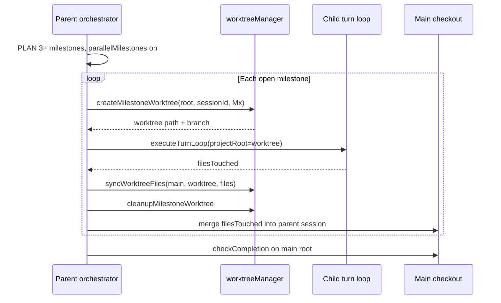

# Parallel milestone subagents v2 — design

> Status: **implemented** (feature-flagged). v1 remains default.

## Problem

v1 **PARALLEL MILESTONES** runs sequential child turn loops on the **same** `projectRoot`. Milestones can clobber each other's partial state, and a failed milestone leaves the workspace dirty for the next.

v2 adds **one git worktree per milestone** so each child loop edits in isolation, then **syncs touched files** back to the parent checkout before the final completion gate.

## Goals

| Goal | v1 | v2 |
|------|----|----|
| Fresh context per milestone | Yes (messages reset) | Yes |
| File isolation per milestone | No | Yes (worktree) |
| Concurrent LLM loops | No | Optional (experimental) |
| Git required | No | Yes |
| Revert All on parent session | Yes | Yes (parent ledger; child ledger per milestone id) |

## Feature flags

| Flag | UI | Default | Requires |
|------|-----|---------|----------|
| `parallelMilestones` | PARALLEL MILESTONES | off | PLAN with 3+ milestones |
| `milestoneWorktrees` | MILESTONE WORKTREES | off | `parallelMilestones` + git repo |
| `milestoneConcurrent` | CONCURRENT MILESTONES | off | `milestoneWorktrees` (experimental) |

Storage: `localStorage` keys `agentsmith_code_parallel_milestones`, `agentsmith_code_milestone_worktrees`, `agentsmith_code_milestone_concurrent`.

IPC: `code-run` `{ parallelMilestones, milestoneWorktrees, milestoneConcurrent }`.

**Interaction with ISOLATED RUN:** When `milestoneWorktrees` is on, whole-run isolation is **skipped** — isolation happens per milestone instead. Avoid nested worktrees.

## Orchestration flow



### Worktree layout

```
.agentsmith/worktrees/
  <parentSessionId>--M1/     branch agentsmith/milestone-<parentSessionId>-M1
  <parentSessionId>--M2/
  ...
```

Session ids for ledger: `<parentSessionId>__M1` (safe suffix, unique per milestone).

### File sync

After each child loop, copy each relative path in `filesTouched` from worktree → main checkout (`fs.copyFileSync`, create parent dirs). Deletes are not propagated in v2 (milestone scope is additive/fix-forward).

Plan artifacts (`.agentsmith/PLAN.md`, `IMPLEMENT.md`) always resolve to **main** `projectRoot` via shared `PlanArtifacts` instance — not the worktree copy.

### Concurrency

When `milestoneConcurrent` is on, milestone loops run via `Promise.all` (one worktree each). **Single LM Studio instance may serialize or fail** under load — flag is experimental. Default remains sequential worktree isolation.

## Events

Existing: `subagent_start`, `subagent_done`.

v2 adds fields: `{ milestoneId, worktreePath?, branch?, mode: 'shared'|'worktree' }`.

## Failure modes

| Failure | Behavior |
|---------|----------|
| Not a git repo | Emit error; fall back to v1 shared-root if only `parallelMilestones` |
| Worktree create fails | Skip milestone with error event; continue or abort parent (abort if zero milestones run) |
| Child loop error | Cleanup worktree; milestone stays open in PLAN |
| Sync copy fails | Log in event; file may be missing on main — completion gate catches |

## Modules

| Module | Role |
|--------|------|
| [`worktreeManager.js`](../../src/main/services/worktreeManager.js) | `createMilestoneWorktree`, `cleanupMilestoneWorktree`, `syncWorktreeFiles` |
| [`milestoneSubagents.js`](../../src/code/loop/milestoneSubagents.js) | `runMilestoneSubagentOrchestrator` — v1/v2 dispatch |
| [`runCodeTask.js`](../../src/code/loop/runCodeTask.js) | Calls orchestrator when `useSubagents` |

## Tests

- `tests/worktreeManager.test.js` — path naming, sync copies files
- `tests/milestoneSubagents.test.js` — mode selection, session id suffix
- Manual: [`MANUAL_SMOKE.md`](../MANUAL_SMOKE.md) — git repo + both toggles

## Out of scope (v3)

- True parallel merge conflict resolution
- Per-milestone port assignment for dev servers
- Trace aggregation across child runs
- Delete propagation from worktree to main
